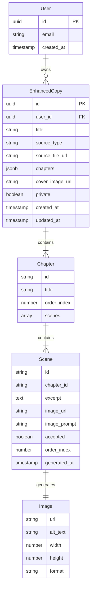

# Data Model: Reader Enhance Flow

**Feature**: Reader Enhance Flow
**Date**: 2025-09-13
**Version**: 1.0.0

## Entity Relationship Diagram



## Core Entities

### EnhancedCopy
Primary entity representing a reader's enhanced version of a story.

**Fields**:
| Field | Type | Required | Description | Constraints |
|-------|------|----------|-------------|-------------|
| id | uuid | Yes | Unique identifier | Primary key, auto-generated |
| user_id | uuid | Yes | Owner of the copy | Foreign key to users table |
| title | string | Yes | Display title | Max 255 chars, sanitized |
| source_type | enum | Yes | How content was provided | 'paste', 'file', 'import' |
| source_file_url | string | No | Original file reference | Supabase storage URL |
| chapters | jsonb | Yes | Nested chapter/scene data | See Chapter structure |
| cover_image_url | string | No | First accepted image | Auto-set from scenes |
| private | boolean | Yes | Visibility flag | Default true, always true in v1 |
| created_at | timestamp | Yes | Creation time | Auto-set |
| updated_at | timestamp | Yes | Last modification | Auto-updated |

**State Transitions**:
```
Created -> Processing -> Ready -> Archived (future)
```

**Validation Rules**:
- Title required, auto-generated from content if not provided
- User must be authenticated
- Maximum 30 scenes total across all chapters
- Chapters array cannot be empty once processing complete

### Chapter (Nested in EnhancedCopy)
Logical division of content, stored in JSONB.

**Fields**:
| Field | Type | Required | Description | Constraints |
|-------|------|----------|-------------|-------------|
| id | string | Yes | Chapter identifier | UUID or sequential |
| title | string | No | Chapter title | Extracted or auto-generated |
| order_index | number | Yes | Display order | Sequential from 0 |
| scenes | array | Yes | Array of Scene objects | Min 1, max 10 per chapter |

### Scene (Nested in Chapter)
Individual scene with generated image.

**Fields**:
| Field | Type | Required | Description | Constraints |
|-------|------|----------|-------------|-------------|
| id | string | Yes | Scene identifier | UUID |
| chapter_id | string | Yes | Parent chapter | References chapter.id |
| excerpt | text | Yes | Text content | 100-2000 chars |
| image_url | string | No | Generated image | Supabase storage URL |
| image_prompt | string | No | Prompt used | For regeneration |
| accepted | boolean | Yes | User approval | Default false |
| order_index | number | Yes | Display order | Sequential in chapter |
| generated_at | timestamp | No | Image creation time | Auto-set |

**State Machine**:
```stateDiagram-v2
    [*] --> Pending
    Pending --> Generating : Start generation
    Generating --> Generated : Success
    Generating --> Failed : Error
    Generated --> Accepted : User accepts
    Generated --> Regenerating : User retries
    Regenerating --> Generated : New image
    Failed --> Regenerating : Retry
    Accepted --> [*]
```

### Image (Referenced by Scene)
Generated image metadata.

**Fields**:
| Field | Type | Required | Description | Constraints |
|-------|------|----------|-------------|-------------|
| url | string | Yes | Storage location | Supabase CDN URL |
| alt_text | string | Yes | Accessibility text | Auto-generated from scene |
| width | number | Yes | Image width | Default 1024 |
| height | number | Yes | Image height | Default 1024 |
| format | string | Yes | File format | 'webp' preferred |

## Database Schema

### PostgreSQL Table Definition

```sql
-- Main table for enhanced copies
CREATE TABLE enhanced_copies (
    id UUID PRIMARY KEY DEFAULT gen_random_uuid(),
    user_id UUID NOT NULL REFERENCES auth.users(id) ON DELETE CASCADE,
    title TEXT NOT NULL,
    source_type TEXT NOT NULL CHECK (source_type IN ('paste', 'file', 'import')),
    source_file_url TEXT,
    chapters JSONB NOT NULL DEFAULT '[]'::jsonb,
    cover_image_url TEXT,
    private BOOLEAN NOT NULL DEFAULT true,
    created_at TIMESTAMPTZ NOT NULL DEFAULT now(),
    updated_at TIMESTAMPTZ NOT NULL DEFAULT now(),

    -- Indexes for performance
    CONSTRAINT valid_chapters CHECK (jsonb_typeof(chapters) = 'array'),
    CONSTRAINT max_word_count CHECK (
        (chapters::text)::text[] && ARRAY[]::text[] OR
        jsonb_array_length(chapters) <= 100
    )
);

-- Indexes
CREATE INDEX idx_enhanced_copies_user_id ON enhanced_copies(user_id);
CREATE INDEX idx_enhanced_copies_created_at ON enhanced_copies(created_at DESC);
CREATE INDEX idx_enhanced_copies_private ON enhanced_copies(private) WHERE private = false;

-- RLS Policies
ALTER TABLE enhanced_copies ENABLE ROW LEVEL SECURITY;

CREATE POLICY "Users can view own copies"
    ON enhanced_copies FOR SELECT
    USING (auth.uid() = user_id);

CREATE POLICY "Users can create own copies"
    ON enhanced_copies FOR INSERT
    WITH CHECK (auth.uid() = user_id);

CREATE POLICY "Users can update own copies"
    ON enhanced_copies FOR UPDATE
    USING (auth.uid() = user_id);

CREATE POLICY "Users can delete own copies"
    ON enhanced_copies FOR DELETE
    USING (auth.uid() = user_id);

-- Update trigger
CREATE TRIGGER update_enhanced_copies_updated_at
    BEFORE UPDATE ON enhanced_copies
    FOR EACH ROW
    EXECUTE FUNCTION update_updated_at_column();
```

### JSONB Structure Example

```json
{
  "chapters": [
    {
      "id": "chapter-1",
      "title": "Chapter 1: The Beginning",
      "order_index": 0,
      "scenes": [
        {
          "id": "scene-1-1",
          "chapter_id": "chapter-1",
          "excerpt": "The old wizard stood at the edge of the cliff, watching the sunset paint the valley in shades of gold...",
          "image_url": "https://storage.supabase.co/enhanced/user123/copy456/scene-1-1.webp",
          "image_prompt": "An old wizard in robes standing at a cliff edge during golden sunset, fantasy landscape",
          "accepted": true,
          "order_index": 0,
          "generated_at": "2025-09-13T10:30:00Z"
        },
        {
          "id": "scene-1-2",
          "chapter_id": "chapter-1",
          "excerpt": "Deep in the forest, creatures stirred as darkness fell...",
          "image_url": "https://storage.supabase.co/enhanced/user123/copy456/scene-1-2.webp",
          "image_prompt": "Dark enchanted forest with mysterious creatures, twilight atmosphere",
          "accepted": false,
          "order_index": 1,
          "generated_at": "2025-09-13T10:31:00Z"
        }
      ]
    }
  ]
}
```

## Type Definitions (TypeScript)

```typescript
// Source types
export type SourceType = 'paste' | 'file' | 'import';

// Image metadata
export interface ImageData {
  url: string;
  alt_text: string;
  width: number;
  height: number;
  format: string;
}

// Scene within a chapter
export interface Scene {
  id: string;
  chapter_id: string;
  excerpt: string;
  image_url?: string;
  image_prompt?: string;
  accepted: boolean;
  order_index: number;
  generated_at?: string;
}

// Chapter containing scenes
export interface Chapter {
  id: string;
  title?: string;
  order_index: number;
  scenes: Scene[];
}

// Main enhanced copy entity
export interface EnhancedCopy {
  id: string;
  user_id: string;
  title: string;
  source_type: SourceType;
  source_file_url?: string;
  chapters: Chapter[];
  cover_image_url?: string;
  private: boolean;
  created_at: string;
  updated_at: string;
}

// API request/response types
export interface CreateEnhancedCopyRequest {
  title?: string;
  source_type: SourceType;
  content: string;
  file?: File;
}

export interface UpdateSceneRequest {
  accepted?: boolean;
  regenerate?: boolean;
}

export interface EnhancedCopyListItem {
  id: string;
  title: string;
  cover_image_url?: string;
  scene_count: number;
  created_at: string;
}
```

## Business Rules

### Creation Rules
1. User must be authenticated
2. Title auto-generated if not provided (first 50 chars of content)
3. Initial state has empty scenes array
4. Private flag always true in v1

### Processing Rules
1. Maximum 50,000 words input
2. Maximum 2MB file size
3. Target 3-5 scenes per 1000 words
4. Maximum 30 scenes total
5. Minimum 100 characters per scene excerpt

### Image Generation Rules
1. One image per scene
2. Images generated sequentially or in parallel (configurable)
3. Failed generations can be retried
4. User must accept/reject each image
5. Cover image = first accepted scene image

### Storage Rules
1. Images stored in user-specific folders
2. Automatic cleanup after 30 days if not accepted
3. Source files retained for 7 days
4. JSONB data denormalized for read performance

### Access Rules
1. Users can only see their own copies
2. No public sharing in v1
3. Soft delete (archive) planned for v2
4. Export functionality planned for v2

## Query Patterns

### Common Queries

```sql
-- Get user's enhanced copies
SELECT id, title, cover_image_url,
       jsonb_array_length(chapters) as chapter_count,
       created_at
FROM enhanced_copies
WHERE user_id = $1
ORDER BY created_at DESC
LIMIT 20;

-- Get specific copy with scenes
SELECT *
FROM enhanced_copies
WHERE id = $1 AND user_id = $2;

-- Count total scenes for a user
SELECT SUM(
  (SELECT COUNT(*)
   FROM jsonb_array_elements(chapters) AS chapter
   CROSS JOIN jsonb_array_elements(chapter->'scenes'))
) as total_scenes
FROM enhanced_copies
WHERE user_id = $1;

-- Update scene acceptance
UPDATE enhanced_copies
SET chapters = jsonb_set(
  chapters,
  '{0,scenes,0,accepted}',
  'true'
),
updated_at = now()
WHERE id = $1 AND user_id = $2;
```

## Migration Strategy

### Initial Migration (v1.0.0)

```sql
-- Migration: 001_create_enhanced_copies.sql
BEGIN;

CREATE TABLE IF NOT EXISTS enhanced_copies (
  -- table definition as above
);

-- Create storage buckets
INSERT INTO storage.buckets (id, name, public)
VALUES ('enhanced-copies', 'enhanced-copies', false)
ON CONFLICT DO NOTHING;

COMMIT;
```

### Future Migrations
- v1.1.0: Add sharing capabilities (public flag meaningful)
- v1.2.0: Add collaboration features (shared_with array)
- v2.0.0: Separate scenes table for complex queries

## Performance Considerations

1. **JSONB Indexing**: GIN index on chapters for complex queries
2. **Pagination**: Limit enhanced copies list to 20 per page
3. **Lazy Loading**: Load scene images on demand in reading view
4. **Caching**: Cache enhanced copy data for 5 minutes
5. **Batch Operations**: Update multiple scenes in single query

## Data Validation

### Client-Side
- File type validation before upload
- Text length validation
- Title length limits
- Scene count warnings

### Server-Side
- Strict type checking on all inputs
- File size enforcement
- Word count validation
- SQL injection prevention via parameterized queries
- XSS prevention via content sanitization

## Audit & Monitoring

### Track Key Metrics
- Average scenes per copy
- Image generation success rate
- Average processing time
- Storage usage per user
- Retry rates for image generation

### Logging Requirements
- User actions (create, update, delete)
- Generation failures with context
- Performance bottlenecks
- Rate limit violations